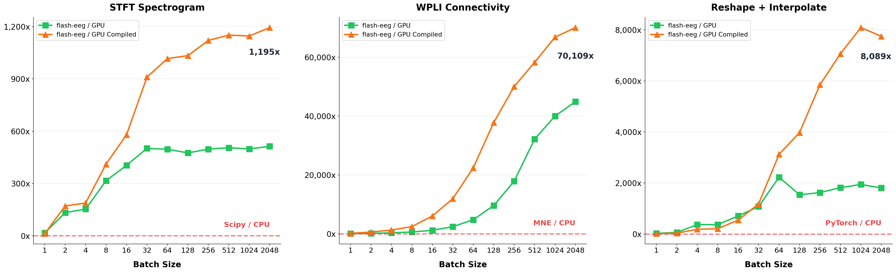

# flash-eeg

GPU-accelerated electrophysiology (EEG, iEEG, LFP) transforms for large batch jobs. Built on PyTorch (cuFFT).



*GPU: NVIDIA GH200 with `torch.compile`. CPU: MNE-Python / Scipy, fully parallelized (2x Xeon 8568Y+).

## Install

```bash
pip install flash-eeg
```

## Usage

```python
import flash_eeg as feeg
import torch

x = torch.randn(1024, 8, 7500, device="cuda")  # [batch, channels, samples]

# One-line transforms
spec = feeg.spectrogram(x)     # STFT spectrogram     -> [B, C, 224, 224]
morlet = feeg.morlet(x)        # Morlet wavelet        -> [B, C, 224, 224]
conn = feeg.connectivity(x)    # WPLI connectivity     -> [B, 1, 224, 224]
img = feeg.reshape(x)          # Signal-to-image       -> [B, C, 224, 224]
filt = feeg.bandpass(x)        # FFT bandpass filter    -> [B, C, T]

# Raw output (no normalization or resize)
raw = feeg.spectrogram(x, output="raw")  # [B, C, n_freqs, T_frames]

# Works with float16 / bfloat16 (AMP training)
x_fp16 = x.half()
spec = feeg.spectrogram(x_fp16)  # computes in fp32, returns fp16
```

### Class API

```python
spec_fn = feeg.Spectrogram(device="cuda")  # nn.Module
for batch in dataloader:
    images = spec_fn(batch)  # auto-compiles on A100/H100/H200
```

Both APIs have identical performance. The functional API uses `lru_cache` internally — same parameters reuse the compiled module.

### Options

```python
feeg.spectrogram(x, output_size=128, n_fft=512, hop_length=64)
feeg.morlet(x, n_freqs=30, freq_min=1.0, freq_max=100.0, n_cycles=5)
feeg.connectivity(x, n_fft=1024, num_tapers=5)
feeg.bandpass(x, sfreq=250.0, low=0.5, high=45.0, rolloff=2.0)
feeg.spectrogram(x, compile=True)   # force compile on/off
feeg.clear_cache()                   # free cached GPU modules
```

## Performance

Data: 8 channels, 30s @ 250Hz.

| Transform | CPU (B=1024) | GPU compiled | Speedup |
|---|---|---|---|
| STFT Spectrogram (vs Scipy) | 7.17s | 6.3ms | **1,146x** |
| Morlet Wavelet (vs MNE) | 59.2s | 41.1ms | **1,439x** |
| WPLI Connectivity (vs MNE) | 72.1s | 1.1ms | **66,870x** |
| Reshape + Interpolate | 6.96s | 0.9ms | **8,089x** |

## License

MIT
